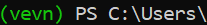
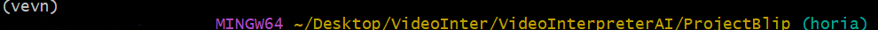

# Video interpreter using AI

## Horia Branchu

### How to use?

1. Create an virtual environment(recommended):
```bash
python -m venv <venv_name>
```
- Use the names that appear in .gitignore under the Environments section
2. Activate the environment:
- If you are on Windows there are a few ways to do it:
  1. If you are using powershell(not worth the headache, don't recommend):
    - then you'll probably need to change the ExecutionPolicy in order to run scripts. Here is a link where you can find the policies and how to change them(open in administrator):<br>
    https://learn.microsoft.com/en-us/powershell/module/microsoft.powershell.core/about/about_execution_policies?view=powershell-7.5
    - In powershell you can use the following command to activate the virtual environment:
    ```Powershell
    <venv_name>\Scripts\Activate.ps1
    ```
    - It should look like this:<br>
    
  2. If you are using bash(or any Unix-like shell):
    - You just run this command:
    ```bash
    source <venv_name>/Scripts/activate
    ```
    - It should looke like This:<br>
    
  3. If you are using CMD:
    - You just run this command:
    ```CMD
    <venv_name>\Scripts\activate.bat
    ```
    (Looks the same as the Powershell one)

- If you are on Linux:
```bash
source <venv_name>/bin/activate
```
(Looks similar to the bash one from Windows as long you did not rice your shell)
<br>
3. Install the requirements(Make sure you are inside the virtual environment before this step)
```bash
pip install -r requirements.txt
```
4. run run.py
```bash
python run.py
```

### Features:

- Real-time scene description using `blip-image-captioning-base`
- Visual question answering using `blip-vqa-base`
- Gradio web interface for:
  - Live webcam feed
  - Video analysis
  - Continuous scene description
  - User prompts with answers
- Will use the GPU(If available) for faster processing and runs in float16 for precision instead of float32 to save memory and increased speed
- If bitsandbytes is available, the models can run in 8-bit precision to save memory while keeping almost full accuracy(https://github.com/bitsandbytes-foundation/bitsandbytes). This is not set as default but can be done by changing inside the scripts.py file the model used in describeScene() and answerPrompt() from caption_model and vqa_model to caption_model8 and vqa_model8.

### Things to keep in mind: 
- If you are using the Live webcam for real-time analysis and then inputing a video, the webcam will take priority so you will need to stop the webcam and then press a few times the *Interpret Uploaded Video* in order to get the answers